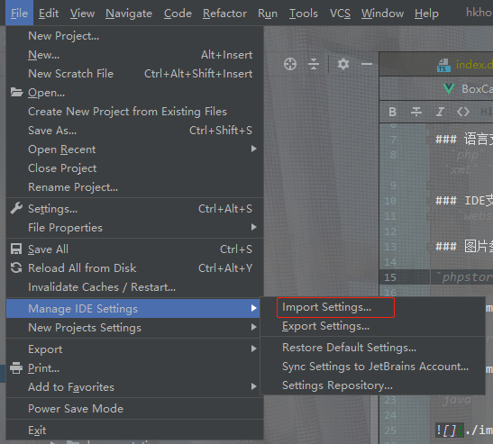
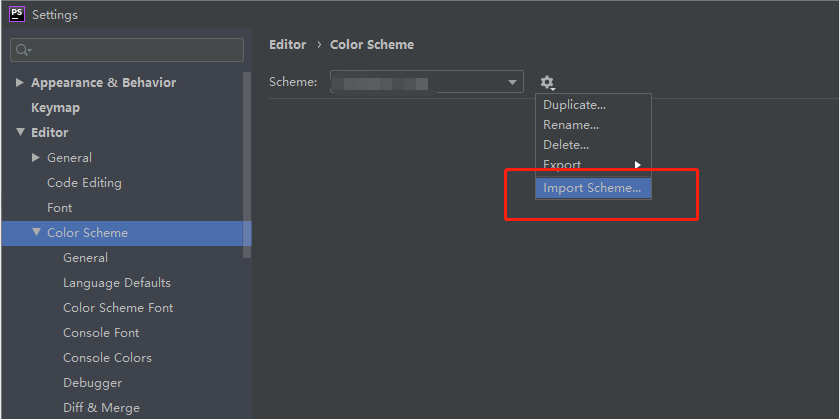

# JetBrains-scheme
自定义的JetBrains主题，更完美的高亮，如果喜欢，可以给个 **star** 支持下，Thinks ~

### 使用方法

- 方式一： 导入settings.zip

    
- 方式二: 导入相应的icls或jar文件

    以phpstorm为例，File->Settings->Editor->Color Scheme->import 中选择文件导入即可， Joyboo-phpstorm.icls（或Joyboo-phpstorm.jar）
    

    
  
### 语言支持 
  `php` `golang` `java` `sql` `javascript` `html` `css` `xml` `sess` `less`
  
### IDE支持
   `webstorm` `IntelliJ IDEA` `phpstorm` `goland`

### 图片参考

`phpstorm`

`webstorm`

`java`

`golang`

IntelliJ IDEA 中同时支持上述语言
