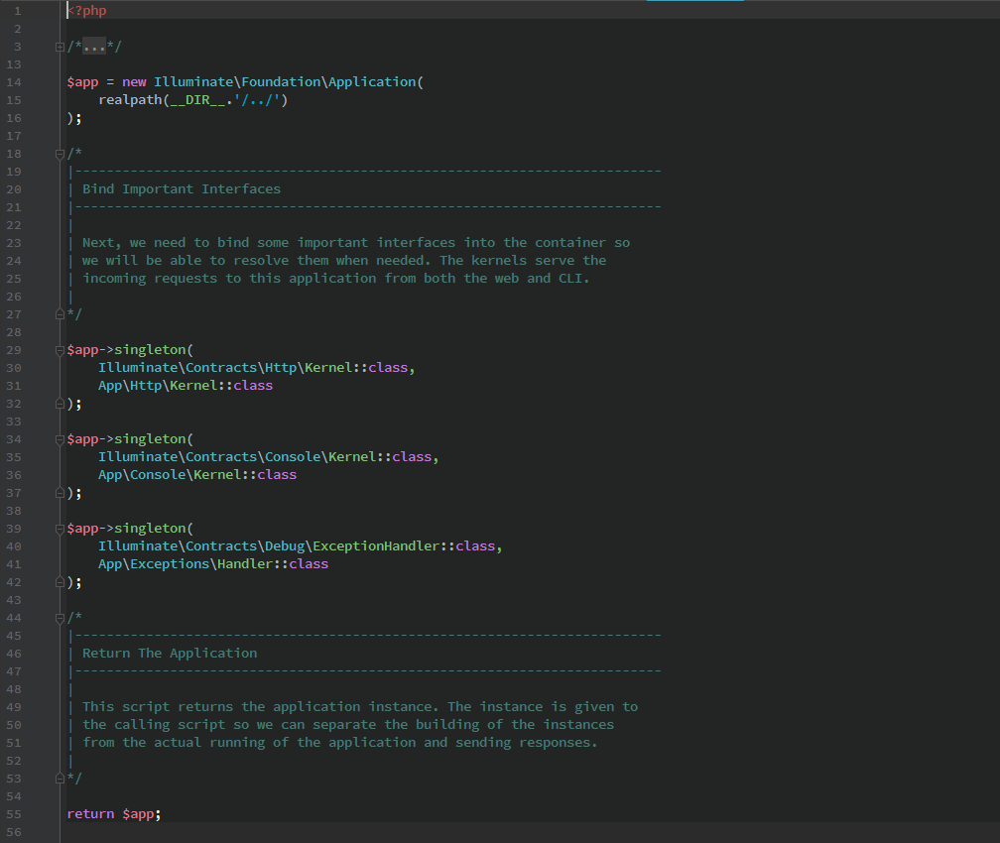
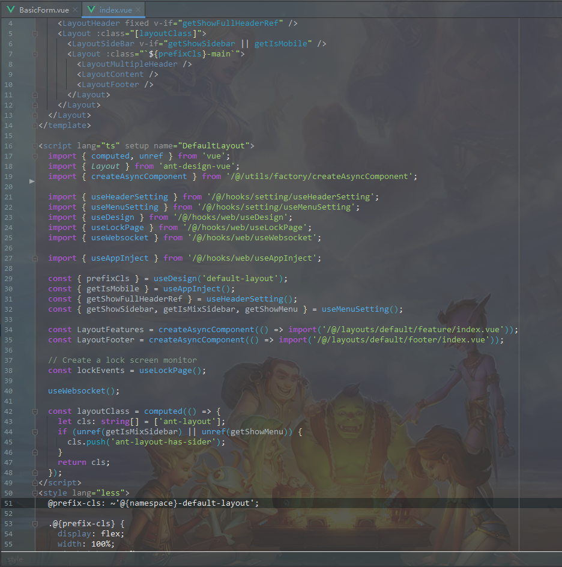
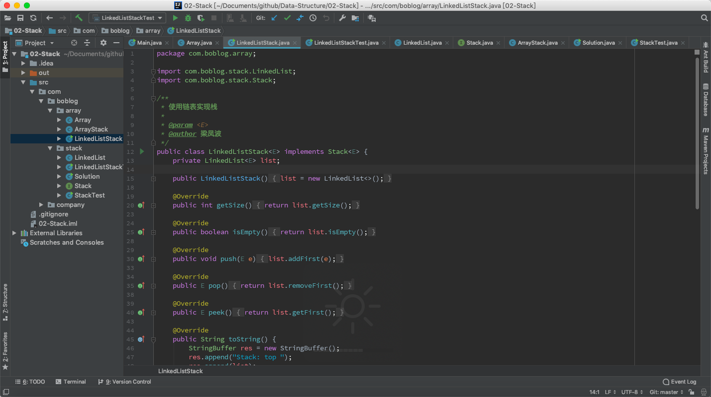
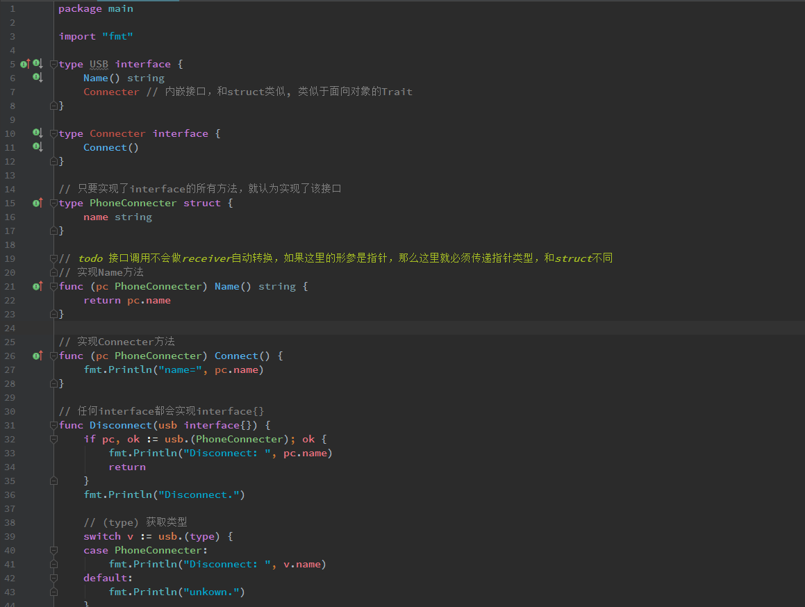
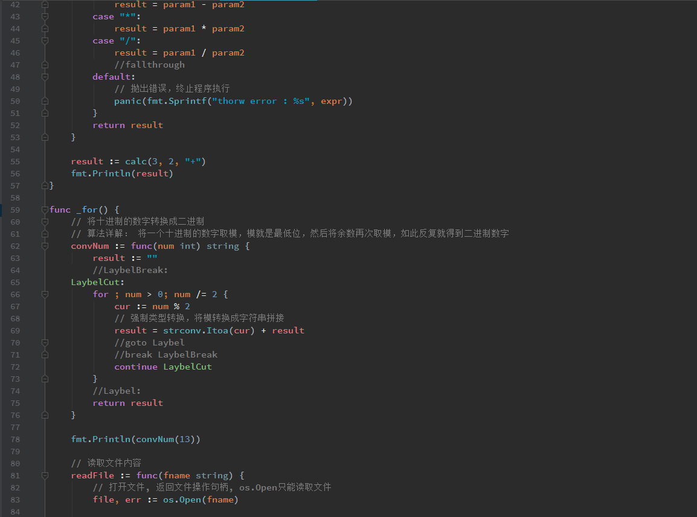
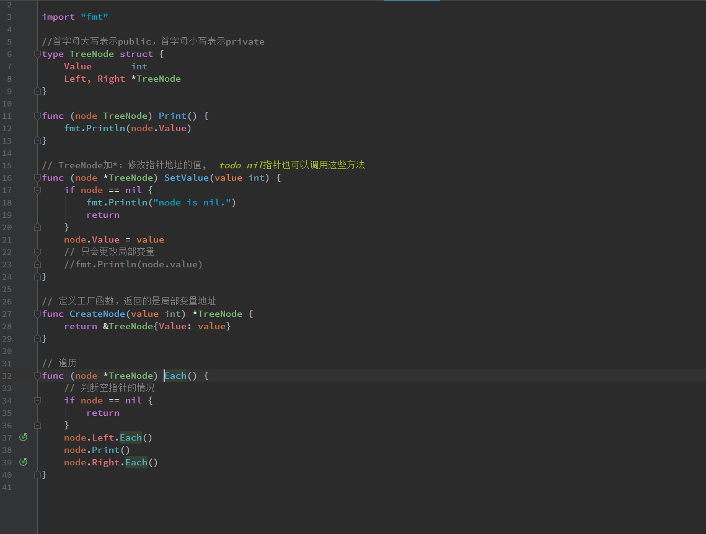

# JetBrains-scheme
自定义的JetBrains主题，更完美的高亮，喜欢的朋友可以给个星星star支持下，谢谢~~

### 使用方法
  直接下载后导入相应的icls或jar文件即可
  
### 语言支持 
  `php` `golang` `java` `sql` `javascript` `html` `css` `xml` `sess` `less`
  
### IDE支持
   `webstorm` `IntelliJ IDEA` `phpstorm` `goland`

### 图片参考

`phpstorm`

`webstorm`

`java`

`golang`

IntelliJ IDEA 中同时支持上述语言
